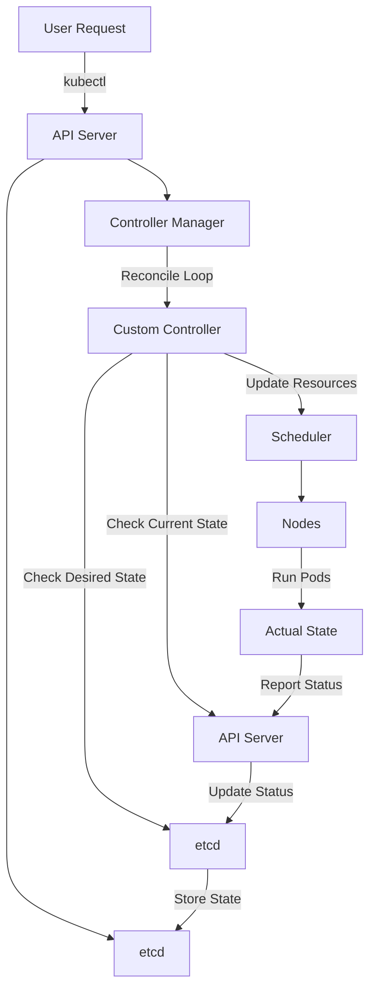

# why the function of controller in kubernete operator is called "reconcile"?

In Kubernetes, the term "reconcile" is used to describe the process by which an operator controller ensures that the current state of a resource matches the desired state specified by the user. 

The name "reconcile" is derived from the concept of reconciliation, which means to make consistent or congruent.

1. **Desired State vs. Current State**:
    - Kubernetes operates on a declarative model where users specify the desired state of the system using YAML or JSON manifests.
    - The actual state of the system is the current state of the resources as observed in the cluster.
2. **Reconciliation Loop**:
    - The core responsibility of a Kubernetes controller (including operators) is to continuously monitor the current state of resources and compare it with the desired state.
    - If there is a discrepancy between the desired state and the current state, the controller takes actions to bring the current state in line with the desired state. This process is known as reconciliation.
3. **Reconcile Function**:
    - The "reconcile" function is the heart of this process. It is called whenever there is a change in the resource or periodically to ensure the desired state is maintained.
    - The function typically involves reading the current state of the resource, comparing it with the desired state, and then performing the necessary operations (such as creating, updating, or deleting resources) to reconcile the two states.
4. **Idempotency**:
    - The reconcile function is designed to be idempotent, meaning that running it multiple times with the same input should produce the same result. This ensures that the system remains stable and consistent even if the function is triggered multiple times.
5. **Event-Driven**:
    - The reconciliation process is often event-driven. When a resource changes (e.g., a new pod is created, or a deployment is updated), an event is generated, and the reconcile function is triggered to handle the change.

In summary, the name "reconcile" aptly describes the function's role in ensuring that the **actual state** of the system matches the **desired state** as defined by the user. It reflects the continuous and iterative nature of the process, where the controller works to "reconcile" any differences between the two states.

### **Explanation**

1. **User Request**:
    - The process starts with a user making a request using `kubectl` to interact with the Kubernetes cluster.
2. **API Server**:
    - The `kubectl` command communicates with the API Server, which is the central management entity of the Kubernetes cluster.
    - The API Server processes the request and updates the desired state in `etcd`.
3. **etcd**:
    - `etcd` is the key-value store where Kubernetes stores all its cluster data, including the desired state of the resources.
4. **Controller Manager**:
    - The Controller Manager watches the API Server for changes to the desired state and triggers the appropriate controllers to reconcile the state.
5. **Custom Controller**:
    - A custom controller (part of the operator) is responsible for reconciling the specific resource.
    - It checks the desired state from `etcd` and the current state from the API Server.
6. **Reconcile Loop**:
    - The custom controller enters a reconcile loop where it continuously checks and compares the desired state with the current state.
7. **Scheduler**:
    - If the custom controller determines that new pods need to be scheduled, it communicates with the Scheduler.
    - The Scheduler assigns the pods to specific nodes based on resource availability and other constraints.
8. **Nodes**:
    - The nodes are the worker machines in the Kubernetes cluster where the pods are actually run.
9. **Actual State**:
    - The nodes run the pods, and this constitutes the actual state of the system.
10. **Status Reporting**:
    - The nodes report the status of the running pods back to the API Server.
    - The API Server updates the status in `etcd`.
11. **State Storage**:
    - `etcd` stores the updated state, completing the reconciliation process.

This flow ensures that the Kubernetes cluster continuously works to match the actual state of the system with the desired state as specified by the user.